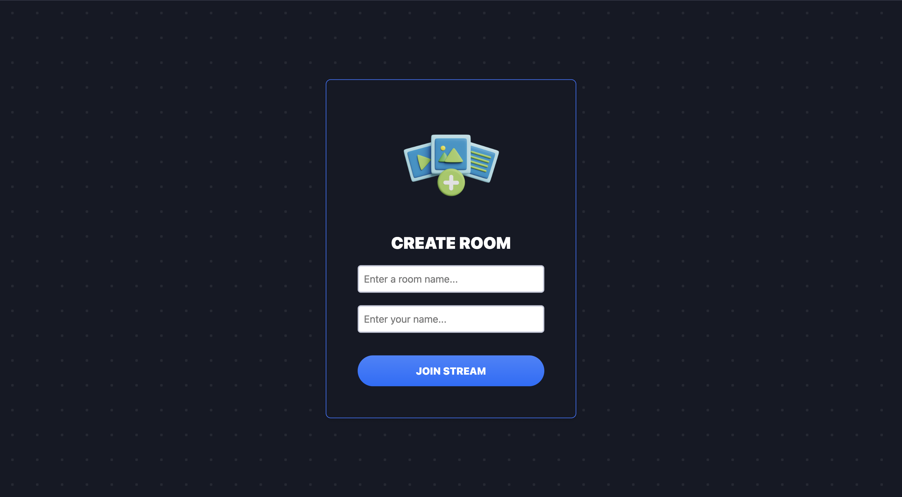
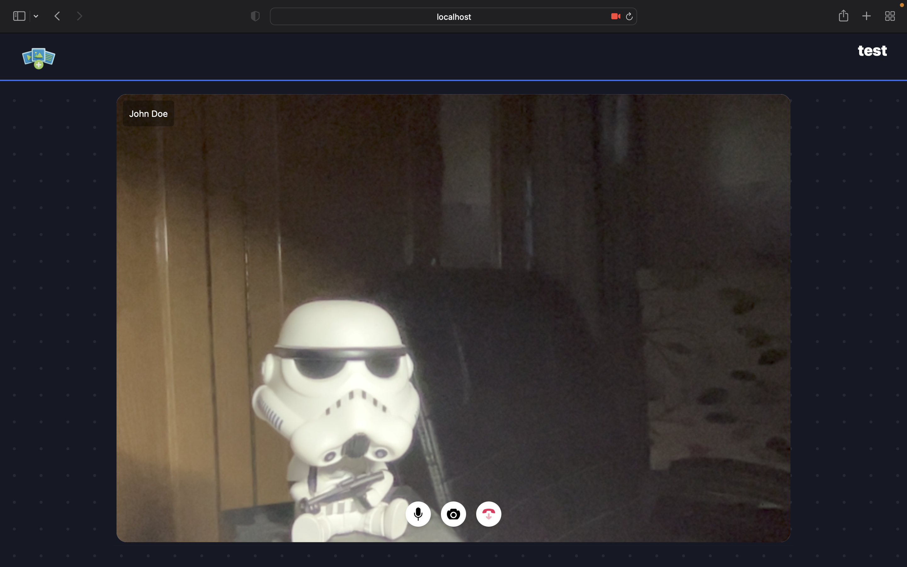
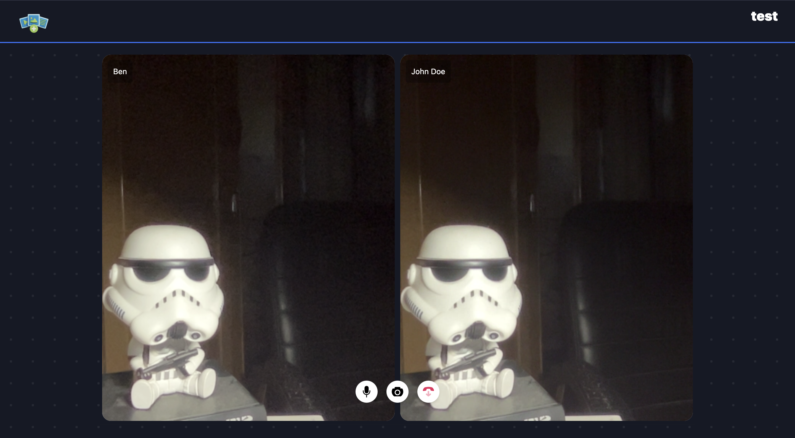

# Baat-Cheet

It is a peer to peer conference call implementation using WebRTC, Socket.io and Node.js.

# Getting Started

- Run `npm ci`
- `cd src`
- `node server.js` or `npm start`

# Features

- Toggling of video stream
- Toggling of audio stream (mute & unmute)
- Text chat (under development)

# Demo

You can test at https://baat-cheet-1pgl.onrender.com/.

# ScreenShots

# Note

You can create a free xirsys account and use their free ice server. You can replace the one used with your own at `src/public/app.js`. The demo may not work on different networks because i have removed the xirsys ice servers. You can also use your own ice servers by creating a free account at [xirsys](https://xirsys.com/). The demo will work on same networks as no ice servers are used when testing on same network.

# Alternative

I would recommend using xirsys as it is free and easy to use. You can also use your own ice servers by creating a free account at [xirsys](https://xirsys.com/). The demo will work on same networks as no ice servers are used when testing on same network. But if you want to use your own ice servers, try ice servers from google or twilio.
